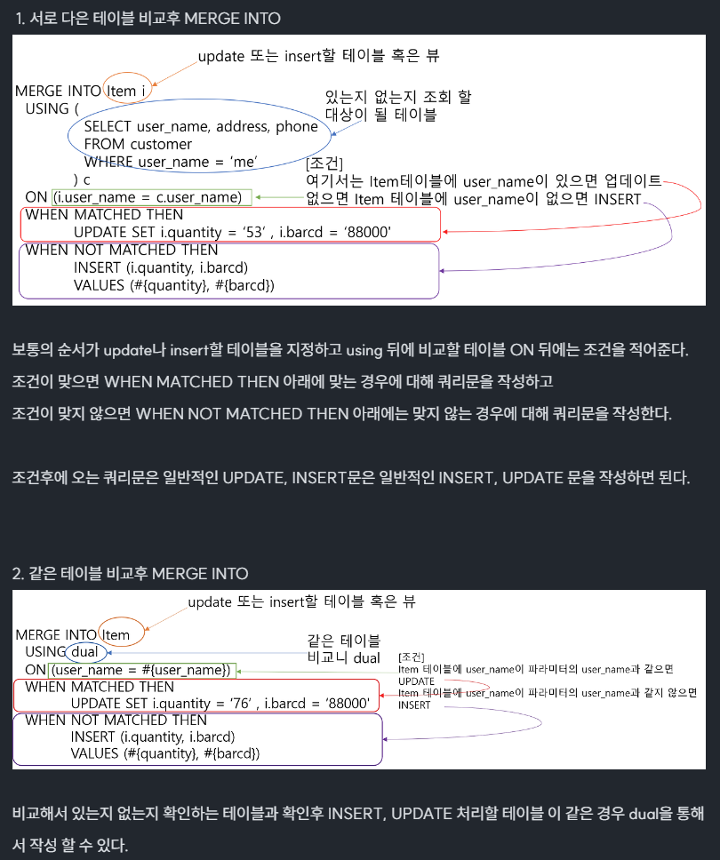

# DataBase
**데이터베이스 내용 정리**

<details>
<summary style="font-size:16px ">Oracle Pivot Table 사용 전후 예제</summary>
<div markdown="1">

### Oralce 11g 이전 Pivot 사용 X

```sql
SELECT *
  FROM ( 피벗 대상 쿼리문 )
 PIVOT ( 그룹합수(집계컬럼) FOR 피벗컬럼 IN (피벗컬럼값 AS 별칭 ... )
 
ST AS	-- SALES TARGET
(
	SELECT
		DEALER_NM, DSPY_RANK, 'New Vehicle Sales' CATE1, CATE2, CATE3
		, NVL(SUM(DECODE(MON, '01', SALES_TARGET)),0) AS JAN		
		, NVL(SUM(DECODE(MON, '02', SALES_TARGET)),0) AS FEB
		, NVL(SUM(DECODE(MON, '03', SALES_TARGET)),0) AS MAR
		, NVL(SUM(DECODE(MON, '04', SALES_TARGET)),0) AS APR
		, NVL(SUM(DECODE(MON, '05', SALES_TARGET)),0) AS MAY
		, NVL(SUM(DECODE(MON, '06', SALES_TARGET)),0) AS JUN
		, NVL(SUM(DECODE(MON, '07', SALES_TARGET)),0) AS JUL
		, NVL(SUM(DECODE(MON, '08', SALES_TARGET)),0) AS AUG
		, NVL(SUM(DECODE(MON, '09', SALES_TARGET)),0) AS SEP
		, NVL(SUM(DECODE(MON, '10', SALES_TARGET)),0) AS OCT
		, NVL(SUM(DECODE(MON, '11', SALES_TARGET)),0) AS NOV
		, NVL(SUM(DECODE(MON, '12', SALES_TARGET)),0) AS DEC
		, NVL(SUM(SALES_TARGET),0) AS TOT
	FROM 
	(
		SELECT 
			CASE DEALER_ID WHEN 'DT00000' THEN '렉서스 강남'
					       WHEN 'CW00000' THEN '렉서스 용산'
					       WHEN 'CT00000' THEN '렉서스 분당'
					       WHEN 'SY00000' THEN '렉서스 인천'
					       WHEN 'KM00000' THEN '렉서스 부산'
					       WHEN 'NY00000' THEN '렉서스 광주'
					       WHEN 'YM00000' THEN '렉서스 대구'
					       WHEN 'JB00000' THEN '렉서스 대전' END DEALER_NM,
			TARGET_M MON,
			DSPY_RANK,
			SUM(SALES_TARGET_QTY) SALES_TARGET,
			'Sales(Delivery)' CATE2, 'Target' CATE3
		FROM
		(
			SELECT
				CASE WHEN VMTS.DEALER_ID = 'PM00000' THEN 'DT00000' ELSE VMTS.DEALER_ID END DEALER_ID,
				TO_CHAR(TO_DATE(TARGET_YM, 'YYYYMM'), 'MM') TARGET_M,
				SALES_TARGET_QTY,
				D.DSPY_RANK DSPY_RANK
			FROM
				VT_MONTHLY_TARGET_SHOP VMTS INNER JOIN DEALER D
				ON VMTS.DEALER_ID = D.DEALER_ID
			WHERE 
				SUBSTR(TARGET_YM, 1, 4) = '2023'
		) A
		GROUP BY 
			DEALER_ID, TARGET_M, DSPY_RANK
		UNION 
		SELECT 
			'Total' DEALER_NM,
			TARGET_M MON,
			99 DSPY_RANK,
			SUM(SALES_TARGET_QTY) SALES_TARGET,
			'Sales(Delivery)' CATE2, 'Target' CATE3
		FROM 
		(
			SELECT
				CASE WHEN VMTS.DEALER_ID = 'PM00000' THEN 'DT00000' ELSE VMTS.DEALER_ID END DEALER_ID,
				TO_CHAR(TO_DATE(TARGET_YM, 'YYYYMM'), 'MM') TARGET_M,
				SALES_TARGET_QTY,
				D.DSPY_RANK DSPY_RANK
			FROM
				VT_MONTHLY_TARGET_SHOP VMTS INNER JOIN DEALER D
				ON VMTS.DEALER_ID = D.DEALER_ID
			WHERE 
				SUBSTR(TARGET_YM, 1, 4) = '2023'			
		) A2
		GROUP BY 
			TARGET_M
	) B
	GROUP BY 
		DEALER_NM, DSPY_RANK, CATE2, CATE3
)
```

### Oralce 11g Pivot 사용 O

```sql
ST AS	-- SALES TARGET
(
	SELECT
		DEALER_NM, DSPY_RANK, 'New Vehicle Sales' CATE1, CATE2, CATE3, 
		NVL(JAN,0) JAN,
		NVL(FEB,0) FEB,
		NVL(MAR,0) MAR,
		NVL(APR,0) APR,
		NVL(MAY,0) MAY,
		NVL(JUN,0) JUN,
		NVL(JUL,0) JUL,
		NVL(AUG,0) AUG,
		NVL(SEP,0) SEP,
		NVL(OCT,0) OCT,
		NVL(NOV,0) NOV,
		NVL(DEC,0) DEC,
		NVL(JAN+FEB+MAR+APR+MAY+JUN+JUL+AUG+SEP+OCT+NOV+DEC,0) TOT
	FROM 
	(
		SELECT 
			CASE DEALER_ID WHEN 'DT00000' THEN '렉서스 강남'
					       WHEN 'CW00000' THEN '렉서스 용산'
					       WHEN 'CT00000' THEN '렉서스 분당'
					       WHEN 'SY00000' THEN '렉서스 인천'
					       WHEN 'KM00000' THEN '렉서스 부산'
					       WHEN 'NY00000' THEN '렉서스 광주'
					       WHEN 'YM00000' THEN '렉서스 대구'
					       WHEN 'JB00000' THEN '렉서스 대전' END DEALER_NM,
			TARGET_M MON,
			DSPY_RANK,
			SUM(SALES_TARGET_QTY) SALES_TARGET,
			'Sales(Delivery)' CATE2, 'Target' CATE3
		FROM
		(
			SELECT
				CASE WHEN VMTS.DEALER_ID = 'PM00000' THEN 'DT00000' ELSE VMTS.DEALER_ID END DEALER_ID,
				TO_CHAR(TO_DATE(TARGET_YM, 'YYYYMM'), 'MM') TARGET_M,
				SALES_TARGET_QTY,
				D.DSPY_RANK DSPY_RANK
			FROM
				VT_MONTHLY_TARGET_SHOP VMTS INNER JOIN DEALER D
				ON VMTS.DEALER_ID = D.DEALER_ID
			WHERE 
				SUBSTR(TARGET_YM, 1, 4) = '2023'			
		) A
		GROUP BY 
			DEALER_ID, TARGET_M, DSPY_RANK
		UNION 
		SELECT 
			'Total' DEALER_NM,
			TARGET_M MON,
			99 DSPY_RANK,
			SUM(SALES_TARGET_QTY) SALES_TARGET,
			'Sales(Delivery)' CATE2, 'Target' CATE3
		FROM 
		(
			SELECT
				CASE WHEN VMTS.DEALER_ID = 'PM00000' THEN 'DT00000' ELSE VMTS.DEALER_ID END DEALER_ID,
				TO_CHAR(TO_DATE(TARGET_YM, 'YYYYMM'), 'MM') TARGET_M,
				SALES_TARGET_QTY,
				D.DSPY_RANK DSPY_RANK
			FROM
				VT_MONTHLY_TARGET_SHOP VMTS INNER JOIN DEALER D
				ON VMTS.DEALER_ID = D.DEALER_ID
			WHERE 
				SUBSTR(TARGET_YM, 1, 4) = '2023'			
		) A2
		GROUP BY 
			TARGET_M
	) B
	PIVOT(
			SUM(SALES_TARGET) FOR MON IN (
									'01' AS JAN,
									'02' AS FEB,
									'03' AS MAR,
									'04' AS APR,
									'05' AS MAY,
									'06' AS JUN,
									'07' AS JUL,
									'08' AS AUG,
									'09' AS SEP,
									'10' AS OCT,
									'11' AS NOV,
									'12' AS DEC
									))
)
```

</div>
</details>

<details>
<summary style="font-size:16px ">Oracle NVL -> PostgreSQL COALESCE 전환</summary>
<div markdown="1">

### NVL 함수 PostgreSQL 대체 함수 COALESCE

* ORACLE 에서는 ''(싱글 쿼테이션)을 NULL로 취급하지만, PostgreSQL 에서는 '' 과 NULL을 다른 값으로 취급하기에 ORACLE과 동일한 결과를 얻기 위해서는 NULLIF 함수를 사용하여 name 항목의 값이 '' 인 경우 NULL을 리턴하도록 변환시켜주어야 합니다.

```SQL
 -- ORACLE 
 SELECT NO, COALESCE(NAME, 'NONE') FROM TESTTABLE;

 -- POSTGRESQL
 SELECT COALESCE(NULLIF(NAME, ''), 'NONE) FROM TESTTABLE;
```

</div>
</details>

<details>
<summary style="font-size:16px ">Oracle PL/SQL CURSOR</summary>
<div markdown="1">

### Oralce CURSOR

* CURSOR : **ORACLE 서버에서 할당한 전용 메모리 영역에 대한 포인터. (질의의 결과로 얻어진 여러 행이 저장된 메모리상의 위치)**
* 커서는 주로 SELECT 문의 결과 집합을 처리하는데 사용된다.
* 즉, 대부분 SQL 결과 ROW는 여러개 -> 커서를 사용함으로써 ROW에 순차적으로 접근한다.

**Cursor 종류**

1. 명시적 커서 : 사용자가 직접 정의해서 사용
2. 묵시적 커서 : 오라클 내부에서 자동 생성 후 SQL 문장 실행될 때마다 자동으로 만들어져 사용

**Cursor 속성**

* %Found : Fetch 발생하면 true 반환
* %isOpen : 커서 오픈 상태일 경우 true 반환
* %NotFound : 할당할 레코드가 없는 경우 true 반환
* %RowCount : 카운터 역할 오픈 시 0, Fetch 발생할 때마다 1씩 증가

**Cursor 처리 단계 (명시적 커서)**

1. Cursor -> 명시적 커서 선언
2. Open -> 명시적 커서 오픈
3. Fetch -> 커서 데이터 추출
4. Close -> 커서 종료

```sql
-- 명시적 커서 사용 예제
DECLARE
	emp_id number(10);
	emp_name varchar2(20);
	emp_salary number(20);
	
CURSOR cul IS
	select EMPLOYEE_ID, LAST_NAME, SALARY 
	from EMPLOYEES e2 
	where DEPARTMENT_ID='50';
	
BEGIN
	OPEN cul;

	dbms_output.put_line('사번   이름   급여 ');

	LOOP 
		FETCH cul INTO emp_id, emp_name, emp_salary;
		EXIT WHEN cul%NOTFOUND;
	
		dbms_output.put_line(emp_id || ' ' || emp_name || ' ' || emp_salary);
	END LOOP;
	CLOSE cul;
END;

-- Cursor 반복문 사용 방법
For [Record Name] IN [Cursor Name] LOOP

	-- 명시적 커서의 OPEN, FETCH가 자동으로 수행
	SQL Sentences;
    
END LOOP; 
-- 루프문을 빠져 나갈 때 커서가 자동으로 종료

-- Cursor 반복문 사용 예제
DECLARE
	CURSOR emp_cur IS
	SELECT EMPLOYEE_ID, LAST_NAME FROM EMPLOYEES e2
	WHERE SALARY < 5000;
	
BEGIN
	FOR emp_rec IN emp_cur LOOP
		dbms_output.put_line(emp_rec.employee_id || ' ' || emp_rec.last_name);
	END LOOP;
END;

```

</div>
</details>

<details>
<summary style="font-size:16px ">Oracle -> PostgreSQL 전환 주의사항</summary>
<div markdown="1">

### 날짜 형변환

```SQL
-- ORACLE 정상 조회
SELECT TO_DATE(ORDER_DT, 'YYYY-MM-DD') FROM PT_ORDER;

-- POSTGRESQL ERROR - (date/time field value out of range: "9999-99-99")
SELECT TO_DATE(ORDER_DT, 'YYYY-MM-DD') FROM PT_ORDER;
```

* POSTGRESQL은 데이터가 DATE형식에 맞지 않으면 위에 에러 발생.
* 에러 해결 방법은 아래와 같다.
	* 잘못된 날짜를 무시하고 유효한 날짜만 반환
	* 잘못된 날짜를 수정하여 반환

```SQL
-- AS-IS ORACLE
SELECT TO_DATE(ORDER_DT, 'YYYY-MM-DD') FROM PT_ORDER;

-- TO-BE POSTGRESQL (잘못된 날짜를 수정하여 반환)
SELECT
	CASE
		WHEN SUBSTRING(ORDER_DT,6,5) = '99-99' THEN SUBSTRING(ORDER_DT,1,5) || '12-31'
		ELSE ORDER_DT
	END
FROM
	PT_ORDER
WHERE 
	ORDER_DT = '9999-99-99';
```

</div>
</details>

<details>
<summary style="font-size:16px ">MERGE INTO</summary>
<div markdown="1">

### MERGE INTO

* 테이블에 데이터가 이미 존재하면 업데이트, 존재하지 않으면 입력하는 경우 작업을 한번에 처리하는 MERGE INTO 문 활용. (ORACLE, POSTGRESQL 둘 다 활용 가능)



```SQL
-- MERGE INTO 기본 사용 방법
MERGE INTO [TABLE / VIEW] -- update 또는 insert할 테이블 혹은 뷰
    USING [TABLE / VIEW / DUAL] -- 비교할 대상 테이블 혹은 뷰 (위 테이블과 동일할 경우 DUAL을 사용)
    ON [조건] -- UPDATE 와 INSERT 처리할 조건문 (조건이 일치하면 UPDATE / 불일치 시 INSERT)
    WHEN MATCHED THEN  -- 일치하는 경우
          UPDATE SET
          [COLUMN1] = [VALUE1],
          [COLUMN2] = [VALUE2],
          ...
          (DELETE [TABLE] WHERE [COLUMN 1] = [VALUE 1] AND ...) -- UPDATE 뿐만 아니라 DELETE 구문도 사용 가능
    WHEN NOT MATCHED THEN  -- 일치하지 않는 경우
         INSERT (COLUMN1, COLUMN2, ...)
         VALUES (VALUE1, VALUE2, ...)

-- 실사용예제
MERGE INTO TB_SCORE S 
	USING DUAL 
	ON 
	(
	S.COURSE_ID = 'C1' 
	AND S.STUDENT_ID = 'S1'
	)    
	WHEN MATCHED THEN       
		UPDATE
			SET
			S.SCORE = 20     
	WHEN NOT MATCHED THEN       
		INSERT
			(S.COURSE_ID,
			S.STUDENT_ID,
			S.SCORE)       
		VALUES ('C1',
	'S1',
	20);
```

</div>
</details>